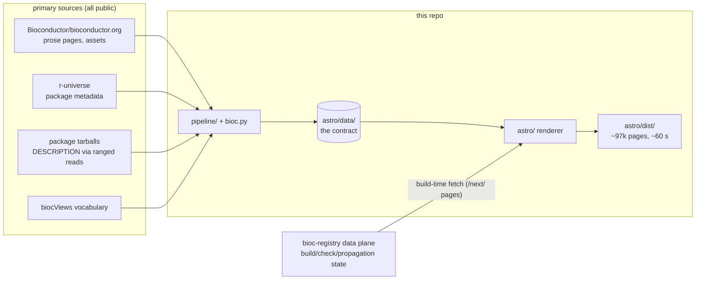
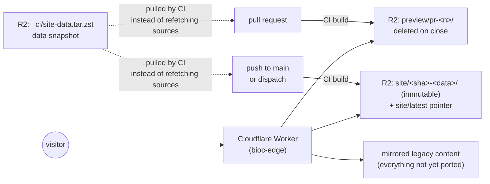

# bioc-website

[](https://github.com/seandavi/bioc-website/actions/workflows/site.yml)

The next-generation [bioconductor.org](https://bioconductor.org) site: a static
Astro build fed by a small Python pipeline, replacing the legacy nanoc site.

For why this exists, what it replaces, and where it stands, see
[docs/OVERVIEW.md](docs/OVERVIEW.md).

Two halves, one seam — `astro/data/` is the contract between them:

| half | does | lives in |
|---|---|---|
| pipeline | fetches from primary sources into `astro/data/` | `pipeline/`, driven by `./bioc.py` |
| renderer | turns `astro/data/` into a static site | `astro/` |

Nothing downstream of `astro/data/` knows where the data came from, and nothing
upstream knows how it is rendered. That seam is what let the same
`PackageDetail` component render both the legacy-parity pages and the
data-plane-fed `/next/` pages unchanged.

## How the site is built



The parity track rebuilds the legacy site's package landing pages, repository
indexes, and biocViews browsers for releases 2.5–3.24, plus the prose pages,
from primary sources — no access to the legacy hosts required. Coverage
against the live site is measured (`just coverage`), not assumed. The `/next/`
track renders check-results and package pages from the
[bioc-registry data plane](https://bioc-registry.seandavi.workers.dev/docs) — new
work; the legacy site never built check pages.

## How builds are published and served



The split is deliberate: **this repo publishes builds; the Worker decides what
is served.** Write access here never implies the power to change production —
that lives with the route table in [bioc-edge](https://github.com/seandavi/bioc-edge), where deploy is a
pointer move and rollback is moving it back.

Concretely (`.github/workflows/site.yml`):

- **Every PR** is built and published to `preview/pr-<n>/`, served at
  `https://bioc-dev.cancerdatasci.org/_pr/<n>/`. The URL is posted as a sticky
  PR comment, the prefix is overwritten on every push, and
  `preview-cleanup.yml` deletes it when the PR closes. Preview pages are
  served `no-cache`. (Internal links are root-absolute and escape the preview
  onto the mirrored legacy site — subdomain previews are
  [#4](https://github.com/seandavi/bioconductor-website/issues/4).)
- **Every push to `main`**, and every `workflow_dispatch`, publishes an
  immutable `site/<sha>-<snapshot hash>/` build and moves the `site/latest`
  pointer. The snapshot hash is part of the id because the Worker's edge
  cache keys on it: a refreshed snapshot on the same commit must get a new id,
  and re-running a build does not refresh cached pages. Retention of old builds is
  [#2](https://github.com/seandavi/bioconductor-website/issues/2).
- **CI builds only the mutable surface** — prose pages, the live releases
  (currently 3.23 and 3.24), and `/next/`. The frozen releases (2.5–3.22) are
  archival: the Worker serves them from the mirrored legacy content in R2, and
  their routes never flip to Astro builds. The renderer discovers releases
  from whatever is in `astro/data/`, so this is a property of the data
  snapshot, not a code path.
- **Builds read a data snapshot**, not primary sources: CI pulls
  `_ci/site-data.tar.zst` (live releases' `astro/data/` plus the copied
  `astro/public/` assets).

  **Prose and assets refresh automatically.** `ops/refresh-content.sh`, run
  every 20 minutes by `ops/systemd/bioc-site-refresh.timer` on onclappc02,
  checks Bioconductor/bioconductor.org `devel`. When it has moved, the script
  regenerates `data/site` and `public/` on top of the current snapshot, uploads
  the result, and dispatches `site.yml`. It keeps every snapshot it replaces
  under `/data/davsean/bioc-site-refresh/snapshots`. To force a run, delete
  `/data/davsean/bioc-site-refresh/upstream-head` and
  `systemctl --user start bioc-site-refresh`.

  **Package data (`data/<release>`) refreshes daily.** `ops/refresh-packages.sh`,
  run at 06:00 UTC by `ops/systemd/bioc-site-packages.timer` on onclappc02,
  reruns `./bioc.py packages` and `./bioc.py tree` for each release already in
  the snapshot, on top of the current snapshot. `since` ("In Bioconductor
  since") and `releases` need every release from 2.5 on disk, so the script
  extracts the frozen 2.5–3.22 history from `_ci/site-data-full.tar.zst` once,
  into `/data/davsean/bioc-site-refresh/history`. Before uploading,
  `pipeline/refresh_check.py` compares the result with the snapshot it
  replaces: if any release/repository lost more than 2% of its packages, or
  any record lacks `since`, `DownloadRank` or `releases`, the run fails and
  nothing is uploaded. A pipeline error fails the run the same way. Both
  scripts take a lock on `/data/davsean/bioc-site-refresh/snapshot.lock` from
  download to upload, so neither overwrites the other's changes. To force a
  run, `systemctl --user start bioc-site-packages`; to try one without
  uploading, `DRY_RUN=1 ops/refresh-packages.sh`. Adding or retiring a live
  release (and moving the retired one into the history) is still by hand.

  **Rolling back** either job: every replaced snapshot is kept for 90 days
  under `/data/davsean/bioc-site-refresh/snapshots`, named for the job that
  replaced it (`*.packages.prev.tar.zst`, `*.prev.tar.zst`). Copy one back
  and rebuild:

  ```sh
  rclone copyto /data/davsean/bioc-site-refresh/snapshots/<file> \
    r2:bioc-site/_ci/site-data.tar.zst
  gh workflow run site.yml -R seandavi/bioc-website --ref main
  ```

  Stop the timers first if the next run would undo the rollback.

  The package refresh's inputs, and what each becomes after the registry
  switch, are planned in [bioc-infrastructure#103](https://github.com/seandavi/bioc-infrastructure/issues/103). How
  site content should be managed and published in general is open for
  discussion in [bioc-infrastructure#91](https://github.com/seandavi/bioc-infrastructure/issues/91).
  The full 35-release data — including the frozen 2.5–3.22 snapshot, which is
  **not regenerable from any live source** — lives at
  `_ci/site-data-full.tar.zst`; swap it in locally to rebuild an archival page
  deliberately.

## Quickstart

```sh
just install        # npm install in astro/
just data           # fetch data for the live releases into astro/data/
just build          # full static build -> astro/dist/
just dev            # dev server on :4321
```

`just --list` shows the finer-grained recipes (content only, one release's
packages.json, etc.). `astro/README.md` has renderer details and a
pipeline-free curl setup for the parity pages.

## Related repos

| repo | role |
|---|---|
| this one | renderer + pipeline; publishes builds |
| [bioc-edge](https://github.com/seandavi/bioc-edge) | Cloudflare Worker, R2 storage, legacy-content sync, route table — decides what production serves |
| bioc-registry data plane | observes r-universe builds, evaluates the propagation gate, publishes the artifacts `/next/` renders |
| [Bioconductor/bioconductor.org](https://github.com/Bioconductor/bioconductor.org) | the legacy nanoc site; still the home of prose content until the markdown import lands here |

## Status

- Parity: package pages for 35 releases rebuild exactly (page count matches
  record count everywhere; 3.23 diffed path-by-path against the legacy build:
  7,614 identical paths, zero spurious). Prose coverage ~97%.
- `/next/`: check-results and package pages per universe, rendered from the
  data plane.
- Not here yet: the one-time markdown import of prose content (after which
  content changes happen in this repo by PR), search, and the cutover itself —
  the legacy site remains the production origin until the strangler migration
  flips routes to these builds.

## Contributing

See [CONTRIBUTING.md](CONTRIBUTING.md). This project follows the
[Bioconductor Code of Conduct](CODE_OF_CONDUCT.md).

---

This repo was extracted (fresh history, 2026-08) from the
bioconductor.org-migration repo; serving infrastructure, sync tooling, and
migration runbooks live in [bioc-edge](https://github.com/seandavi/bioc-edge),
now public.
