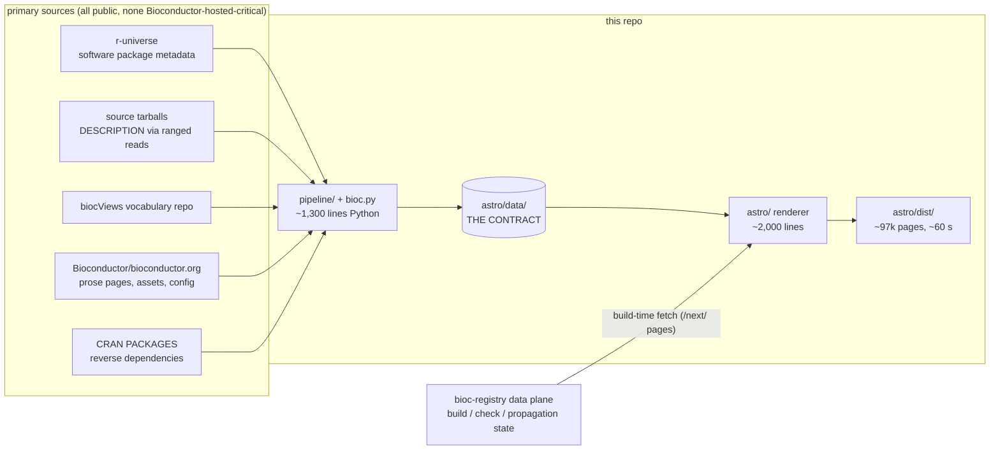
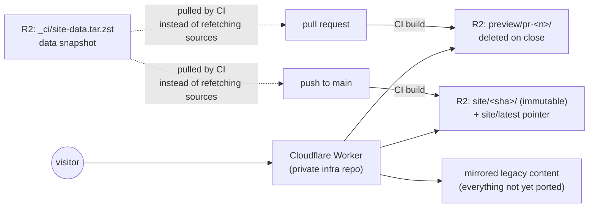

# bioconductor.org, rebuilt from primary sources

**A technical and stakeholder overview of the `bioconductor-website` repo.**
Status as of 2026-08-16.

---

## The short version

bioconductor.org today is a Ruby/nanoc site whose package pages are generated
from data the site itself publishes, served from infrastructure that has to
keep running for the data to keep existing. That is a circular dependency: the
website cannot be moved, and the machines cannot be retired, without first
breaking it.

This repo breaks it. It rebuilds the site as a static build fed by a small
Python pipeline that fetches from **where the data actually originates** —
r-universe, the maintainers' own `DESCRIPTION` files inside source tarballs,
the biocViews vocabulary repo, and the site's own content repo — and then
renders ~97,000 pages in about a minute with no server, no database, and no
Bioconductor-hosted origin in the loop.

The result is not a redesign. It is a **measured reproduction**: for release
3.23 the output was compared path-by-path against the nanoc build and came out
7,614 identical paths, zero spurious. That measurement is what makes the
migration arguable rather than aspirational.

Three consequences follow:

1. **The old infrastructure becomes retirable.** Once no page is built from
   data the old host publishes, the host is serving traffic and nothing else —
   and traffic is the easy part to replace. The staging webserver is already
   redundant; the master, CloudFront, the S3 bucket, and the Open Storage
   Network buckets have ready replacements; and the website no longer depends
   on anything the builders produce. See
   [Legacy infrastructure](#legacy-infrastructure-and-decommissioning) for what
   this does and does not close.
2. **The site becomes contributable.** A pull request produces a preview URL of
   exactly what production would serve. No build machine, no credentials, no
   Ruby toolchain.
3. **The r-universe migration acquires a consumer.** r-universe already builds
   Bioconductor software packages; until now the website did not read from it.
   Now it does, and the `/next/` pages render check results and landing pages
   directly from the r-universe-backed data plane — pages the legacy site never
   had.

---

## Why this work exists

### The circularity problem

The legacy build fetched `VIEWS` — a metadata index — from bioconductor.org,
converted it to `packages.json`, and rendered ~7,600 package landing pages from
it. `VIEWS` is published *by* bioconductor.org. So the site's content was
derived from the site's own output.

That is fine while the host runs forever. It is fatal the moment you want to
move, mirror, or decommission anything: every page depends on the thing you are
trying to switch off. Any migration plan that starts "first, stand up the new
site" immediately discovers it cannot, because the new site's data source is the
old site.

The pipeline in this repo removes that dependency origin by origin. What is
left is a build that could run on a laptop, with bioconductor.org entirely
offline, and produce the same pages.

### The scalability and cost problem

The legacy estate is three purchased and physically maintained builder boxes
(Mac, Linux, Windows), a master webserver, a staging webserver, CloudFront, an
S3 bucket, and — for public-facing assets — Open Storage Network buckets.
Scaling any of it means buying and maintaining more of it. Publishing a fix
means a full site build on the master. Rolling back means rebuilding. Previewing
a change means contending for the one staging box.

The AWS portion of that is about **$5,000/month, roughly $60,000/year** — before
counting the builder hardware or the staff time to keep three operating systems
patched and building.

The static model has a different shape: builds are content-addressed and
immutable, deploy is a pointer move, rollback is moving the pointer back, and
serving is a CDN's problem, not ours. There is no origin to keep alive, patch,
or capacity-plan.

### The contribution problem

The number of people who can safely change bioconductor.org today is bounded by
the number of people with access to the build host and familiarity with nanoc,
ERB, and Haml. That is a small number, and it makes the website a bottleneck
rather than a shared surface.

Under this model the site is a repo: fork, edit, PR, preview URL, merge. The
same workflow the community already uses for packages.

---

## What is true today

| | |
|---|---|
| Package landing pages | 35 releases (2.5–3.24), ~92,000 pages; page count matches record count exactly for every version and repository |
| Path-level parity | 3.23 diffed against the nanoc build: **7,614 identical paths, 0 spurious** |
| Prose pages | ~536 body files + 172 events imported; **~97% coverage** |
| Full build | ~97,000 pages in **~60 s**, single machine, no database |
| Code size | ~1,344 lines of Python (one third-party import: `PyYAML`), ~2,028 lines of Astro/TypeScript |
| Runtime dependencies | 4 (`astro`, `react`, `marked`, `pagefind`) |
| Data footprint | 175 MB for all 35 releases |
| Search | Pagefind — a build-time index, no search backend |
| CI | Every PR builds and publishes a preview URL; every merge publishes an immutable build |
| `/next/` | Check-results matrices and package pages rendered from the r-universe-backed data plane — new capability, never existed on the legacy site |

Not done yet: the one-time markdown import of prose content, and the cutover
itself. The legacy site remains the production origin. See
[What is not done](#what-is-not-done-yet).

---

## Architecture

### Two halves, one seam

`astro/data/` is the contract. Nothing downstream of it knows where the data
came from; nothing upstream knows how it is rendered.

That seam is not architectural decoration — it is what let the **same
`PackageDetail` component** render both the legacy-parity pages (fed by the
pipeline) and the `/next/` pages (fed by the data plane) with no changes. It is
also what makes the migration incremental: an origin can be swapped from
"circular fetch off bioconductor.org" to "real primary source" one repository
at a time, and the renderer never notices.

### Provenance: where every field actually comes from

This table is the decommissioning argument in one place.

| Data | Origin today | Bioconductor-host dependency? |
|---|---|---|
| Software package metadata (`bioc`) | **r-universe** (`bioc-release` / `bioc` universes) | None |
| Annotation / experiment / workflow metadata (~1,392 pkgs) | **`DESCRIPTION` inside each source tarball** — the maintainer's own file | None (tarballs are repository artifacts, servable from any mirror) |
| biocViews category hierarchy | **`Bioconductor/biocViews`** repo, `biocViewsVocab.dot`, pinned per release | None |
| Prose pages, events, assets, site config | **`Bioconductor/bioconductor.org`** git repo | None — the repo is the source, unrelated to the hosts |
| Reverse dependencies | Computed across all four repos + **CRAN `PACKAGES`** | None |
| Download rank | `bio-web-stats` — a separate Flask/Postgres service | Separate service, but *addressed* via the shared hostname (routing must be preserved at cutover) |
| Check results, propagation state (`/next/`) | **bioc-registry data plane** over r-universe builds | None |

Two honest residues, both recorded in `provenance.json` next to the data rather
than papered over:

- A minority of annotation archives are not ordered with `DESCRIPTION` near the
  front (one puts a multi-hundred-megabyte `.rda` first), so no affordable
  ranged read reaches it. Those still fall back to `VIEWS` — still circular —
  and are named explicitly in the report.
- `VIEWS` is a *superset* of the repository: three workflow packages in 3.23
  are listed with no tarball in `src/contrib`. They get a landing page today
  and would not from tarballs alone. Whether that is a regression or a
  correction is a Bioconductor call; the pipeline records it either way.

### The tarball trick

Reading `DESCRIPTION` for ~1,392 annotation, experiment, and workflow packages
naively means downloading hundreds of gigabytes to read a few hundred bytes
each — annotation packages routinely run to hundreds of megabytes.

Instead: `DESCRIPTION` is written near the front of the archive, gzip is a
stream, and object stores serve ranged requests. So the pipeline fetches the
first **64 KB**, inflates what that yields (~200 KB of tar), and walks the
512-byte tar headers to find it. Roughly **0.1–0.2 s per package, bounded at
64 KB regardless of package size.**

The cost is disclosed rather than hidden: whole-archive facts
(`hasNEWS`, `hasREADME`, vignette lists) are not visible from a prefix, so they
are reported as *unavailable* rather than guessed. Guessing them `false` would
have silently dropped documentation links from ~1,400 landing pages — exactly
the class of "green build measuring the wrong thing" this project is designed
to avoid.

### Correctness is measured, not asserted

`just coverage` reports two directions, because either alone misleads:

- **Precision** — every URL we emit must exist upstream. Inventing URLs is
  worse than omitting them: a 200 on a page the real site does not have is a
  silent wrong answer.
- **Recall** — every URL upstream has must be emitted, reported **per page
  type**. A single percentage over a corpus that is 99% package pages would
  read as ~100% while every prose page was missing.

The same discipline shows up throughout: page counts are checked against record
counts; provenance is written to disk so a build that silently fell back to a
circular source is detectable afterwards; ERB detection was tightened after a
naive `<%` match misfiled a 6,973-line release-notes page (R's `%<%` operator
appears in package NEWS).

---

## How builds are published and served

**This repo publishes builds; the Worker decides what is served.** Write access
here never implies the power to change production — that lives with the route
table in the private infra repo, where deploy is a pointer move and rollback is
moving it back.

This is the *strangler* pattern, and it is why the migration does not need a
flag day. The Worker serves mirrored legacy content for everything not yet
ported; routes flip to Astro builds one surface at a time; any flip is
reversible in seconds.

Operationally:

- **Every PR** builds and publishes to `preview/pr-<n>/`, with the URL posted as
  a sticky comment. That build is byte-for-byte what production would serve.
- **Every merge to `main`** publishes an immutable `site/<sha>/` and moves the
  `site/latest` pointer.
- **CI builds only the mutable surface** — prose, the live releases (3.23,
  3.24), and `/next/`. Releases 2.5–3.22 are archival: the Worker serves them
  from mirrored content and those routes never flip. The renderer discovers
  releases from whatever is in `astro/data/`, so this is a property of the data
  snapshot, not a code path.
- **Builds read a data snapshot**, not primary sources, so CI is fast and does
  not hammer upstream. The full 35-release snapshot — including the frozen
  2.5–3.22 data, which is **not regenerable from any live source** — is
  preserved separately.

---

## What this unlocks

**Check results as a first-class website surface.** The legacy site never built
check pages. `/next/{universe}/checkResults.html` renders the check matrix
worst-first with a propagated-version column, and
`/next/{universe}/package/{pkg}.html` renders a landing page per propagated
package — through the same component as the parity pages. Version truth is the
propagation index, not "whatever r-universe last built", and version skew
between the two is surfaced in a banner rather than hidden.

**A search-first package finder.** The biocViews page is now one box that
matches package names, titles, and category terms, with the category tree as
facet navigation and results as a table. The legacy `#___Term` deep-link
contract is preserved. It is deliberately the site's **only** hydrated island —
everything else is static HTML.

**Site-wide search with no backend.** Pagefind builds the index at build time.
No search service to run, fund, or monitor.

**Content contribution by PR.** Once the markdown import lands, changing a page
on bioconductor.org is a pull request with a preview — reviewable by anyone,
requiring access to nothing.

**Graceful degradation as a property, not a hope.** An r-universe outage
degrades `/next/` pages to "no download counts"; it never fails a build. Code
highlighting happens at build time, so no page depends on a CDN being up to
render. jQuery is served from the vendored copy rather than a 2011 Google CDN
URL — one fewer third-party origin.

**A build anyone can run.** `just install && just data && just build`. No
credentials, no build host, no database.

---

## Legacy infrastructure and decommissioning

The estate being retired has three layers, and they came apart in a specific
order — which matters, because the website was the thing holding them together.

### The estate today

| Component | What it does | Replaced by | Status |
|---|---|---|---|
| **Mac / Linux / Windows builders** | Three purchased, physically maintained boxes that build and check every package | **r-universe** | **Elimination is the plan.** Software packages are migrated. The path for annotation, experiment, and workflow packages is the open workstream — see below |
| **Master webserver** | The main origin, Apache, serving the nanoc docroot | **Cloudflare Worker + R2**, serving immutable static builds | Ready; awaiting cutover |
| **Staging webserver** | A second box to preview changes before publishing | **Per-PR preview URLs** — every pull request builds and publishes its own | **Already redundant.** A preview is byte-for-byte what production would serve, and there is one per PR rather than one shared machine |
| **AWS S3 bucket + CloudFront** | Storage and CDN for the docroot and package archives | **R2 + Cloudflare** — no egress fees, same object model | Ready; tarballs already served from the mirror (`pipeline/net.py` defaults there, not to bioconductor.org) |
| **Open Storage Network buckets** | Public-facing assets | **R2** | Ready — and the strongest single argument here: public assets on best-effort academic storage is a reliability and reputational exposure with no upside |
| **`bio-web-stats`** (Flask/Postgres + daily Athena job over CloudFront logs) | Download ranks under `/packages/stats/*` | *Nothing yet* | Already an independent service — it answers `Server: waitress` while every other path answers `Server: Apache/2.4.52`. It is only *addressed* through the shared hostname, so **that route is a must-preserve item at cutover.** Its Athena input disappears with CloudFront and needs a replacement source |

### Why the website was the blocker

Three physical builders, two webservers, a CDN, and two sets of buckets is a
lot of surface for a project whose actual product is packages. The obvious move
— let r-universe build the packages and put the site on object storage — was
blocked by one thing: **the website's package pages were generated from data
the master webserver published.** Retire the master and ~92,000 pages lose
their source. Move to r-universe and the site still reads `VIEWS` off the old
host anyway.

So the builders could not be retired without the website moving, and the
website could not move without a non-circular data source. That is the knot
this repo unties. With provenance moved to r-universe and to maintainers' own
`DESCRIPTION` files, the site no longer reads anything the retiring hosts
produce — and the remaining components become individually retirable rather
than jointly load-bearing.

Concretely: the website is no longer a reason to keep any of these machines
running. What remains between here and three fewer boxes is the build path for
the annotation, experiment, and workflow repositories — a package-infrastructure
question, not a website one.

### What this closes, and what it does not

**Closes:**

- The staging webserver has no remaining job. Per-PR previews are strictly
  better: isolated, one per change, and identical to production output.
- The master webserver's role as a *data source* is gone. Its remaining role is
  serving bytes, which R2 and a Worker do without a machine to maintain.
- CloudFront and the S3 bucket have a like-for-like replacement with no egress
  billing.
- The Open Storage Network dependency for public assets can end today; it is a
  storage swap, not a migration.

**Does not close — stated plainly:**

- **The annotation, experiment, and workflow path.** Eliminating the builders is
  the plan, and r-universe closes it for software packages. It does not cover
  the other three repositories — about 1,392 packages, roughly a third of the
  corpus — so where those get built and hosted is an open workstream, and the
  last one standing between the estate and three fewer machines.

  The useful news is that **the website does not constrain the answer.** Page
  metadata for those packages already comes from `DESCRIPTION` inside the source
  tarballs, not from any build system's index, and the pipeline already reads
  them from a mirror rather than from bioconductor.org. Whatever the decision —
  r-universe universes for data packages, a reduced build path, or publishing
  the tarballs as durable artifacts — the site imposes exactly one requirement:
  **the tarballs must be reachable over HTTP with ranged reads.** Anything
  satisfying that keeps ~1,392 landing pages building unchanged.
- **Download ranks lose their input.** `bio-web-stats` is fed by an Athena job
  over CloudFront logs. Turn off CloudFront and the pipeline that produces
  `Rank` stops, even though the service itself is independent. A replacement
  analytics source is needed before, not after.
- **Three workflow packages** exist in `VIEWS` with no tarball in `src/contrib`.
  They have landing pages today and would not from tarballs alone.

### The cost

**AWS runs about $5,000/month — roughly $60,000/year.** That is the cloud line
alone: it does not include the three builder boxes, which are capital purchases
on a refresh cycle plus the staff time to keep three different operating systems
patched and building.

The replacement is a Cloudflare Worker in front of R2. R2 charges no egress
fees, which matters disproportionately here because a package repository is
almost entirely egress — the workload is "serve tarballs and static pages to the
world", which is precisely the shape CloudFront bills most aggressively for.
Storage volume is modest by comparison: the entire 35-release data corpus this
site builds from is 175 MB.

> **[NEEDS FIGURES]** Worth having on the slide if you can get them: the split
> of that $5k across storage, egress, and compute — the egress share is the part
> that goes to zero, so the split determines whether the saving is most of the
> line or half of it. Also useful: the builder refresh cycle and any purchase
> already due, and the staff time those three boxes consume.

---

## What is not done yet

Tracked in the open issues; nothing here is a surprise.

| | Issue |
|---|---|
| One-time markdown import of prose content into this repo (after which content changes happen here by PR) | — |
| The cutover itself: the legacy site remains the production origin | — |
| Data snapshot refresh is manual; should be scheduled | [#5](https://github.com/seandavi/bioconductor-website/issues/5) |
| Retention/GC for old `site/<sha>` builds | [#2](https://github.com/seandavi/bioconductor-website/issues/2) |
| Subdomain previews — internal links currently escape the preview onto the mirrored site | [#4](https://github.com/seandavi/bioconductor-website/issues/4) |
| Scoped R2 credentials for CI, and the fork-PR question | [#3](https://github.com/seandavi/bioconductor-website/issues/3) |
| CI secrets should come from a Bioconductor-owned location, not a personal one | [#10](https://github.com/seandavi/bioconductor-website/issues/10) |
| Nested `<html lang>` in imported legacy content splits the Pagefind index | [#11](https://github.com/seandavi/bioconductor-website/issues/11) |
| `bioconductor.js` throws three uncaught `TypeError`s on every page (inherited from legacy) | [#12](https://github.com/seandavi/bioconductor-website/issues/12) |
| Legacy trailing-slash redirect corrupts query strings | [#13](https://github.com/seandavi/bioconductor-website/issues/13) |
| ~3% of prose pages still contain ERB that cannot be evaluated (11 pages use it heavily); flagged, not silently half-rendered | — |
| Whole-archive fields (`hasNEWS`, vignette lists) unavailable for tarball-sourced packages | — |

A visual redesign exists on a branch (new shell, design tokens, IA proposal) and
is deliberately kept separate from the parity work: parity is only measurable
while the chrome matches.

---

## Repo map

| Path | What it is |
|---|---|
| `bioc.py` | One entry point for the pipeline; every subcommand writes into `astro/data/` |
| `pipeline/packages.py` | `packages.json` from r-universe + tarballs, with provenance |
| `pipeline/tarballs.py` | The ranged-read `DESCRIPTION` extractor |
| `pipeline/tree.py` | biocViews hierarchy from the vocabulary repo, pinned per release |
| `pipeline/content.py` | Prose pages: nanoc sidecar YAML + ERB normalised into flat JSON |
| `pipeline/coverage.py` | Precision/recall against the live site |
| `pipeline/net.py` | The one place "how we talk to the network" is decided |
| `astro/src/` | The renderer: layouts, components, `/next/` pages, the finder island |
| `.github/workflows/site.yml` | Build → publish preview or immutable build |
| `justfile` | Shortcuts only; all real logic lives in `pipeline/` or `astro/src/` |

### Related repos

| Repo | Role |
|---|---|
| this one | Renderer + pipeline; **publishes builds** |
| private infra repo | Cloudflare Worker, R2 storage, legacy-content sync, route table — **decides what production serves** |
| bioc-registry data plane | Observes r-universe builds, evaluates the propagation gate, publishes what `/next/` renders |
| `Bioconductor/bioconductor.org` | The legacy nanoc site; still the home of prose content until the markdown import lands |

---

## Glossary

**Contract** — `astro/data/`, the JSON the pipeline writes and the renderer
reads. The seam that makes both halves replaceable.

**Circular source** — data fetched from bioconductor.org in order to build
bioconductor.org. What this work eliminates.

**Parity track** — pages rebuilt to match the legacy site exactly, so coverage
can be measured. **`/next/` track** — new pages with no legacy equivalent.

**Propagation gate** — the bioc-registry rule that decides which r-universe
build becomes the published version. `/next/` renders what *propagated*, not
whatever was last built.

**Strangler migration** — routing traffic surface by surface from the old
system to the new, with the old one still serving everything not yet ported, so
there is never a flag day and every step is reversible.
